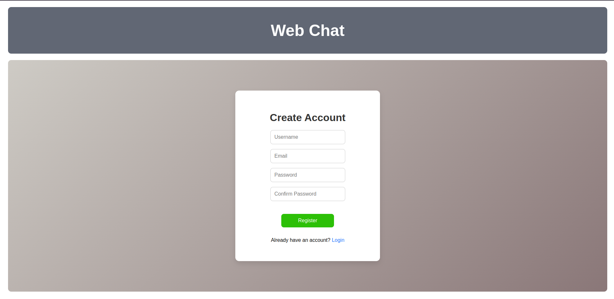
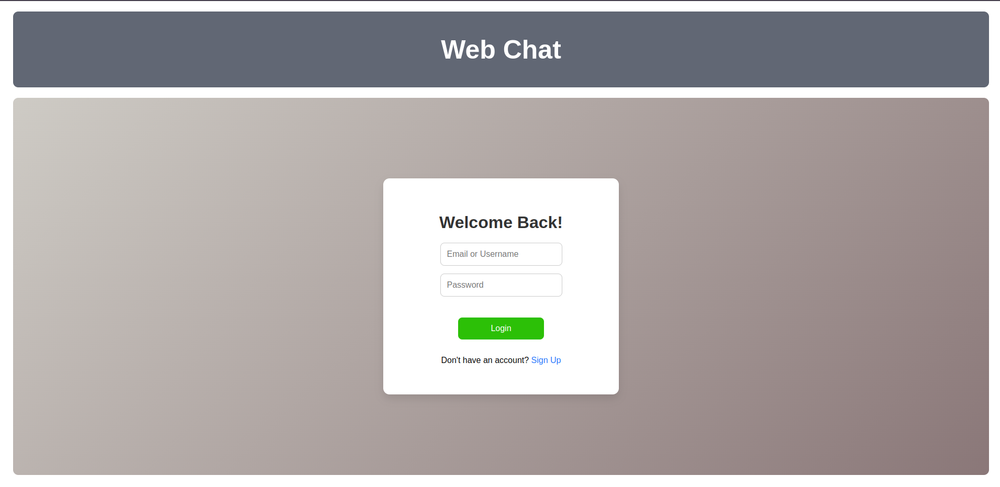
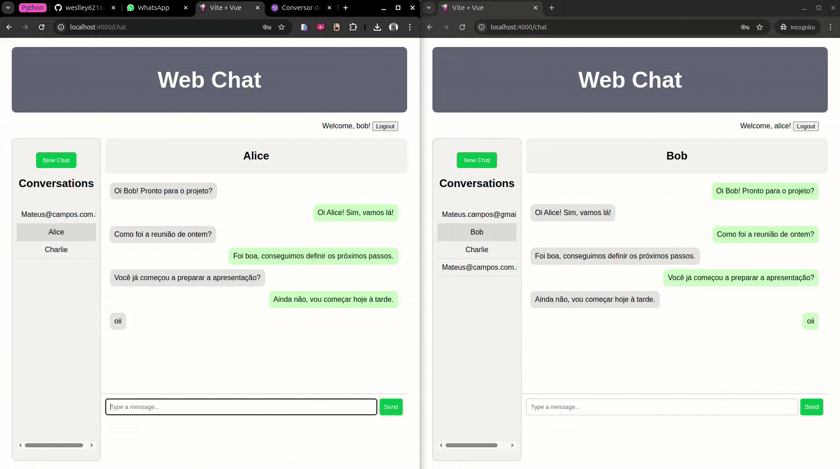

# Chat Frontend

Frontend da aplicação de chat em tempo real, construído com Vue.js.

## Funcionalidades 🚀

* Tela de login (`LoginPage`)
* Tela de registro (`RegisterPage`)
* Tela de chat (`ChatPage`)
* Comunicação em tempo real via WebSockets

## Tecnologias 💻

* Vue 3.5.13
* Vite 6.2.2
* Vitest 3.0.9

## Demonstração Visual ️📹

### Tela de Registro

### Tela de Login

### Interação Chat

## Detalhes Adicionais ℹ️

* O frontend utiliza Vue Router para navegação.
* Gerenciamento de estado com Pinia.
* Comunicação com a API backend via HTTP e WebSockets.
* Interface responsiva.

## Testes 🧪

* Os testes são escritos usando Vitest.
* Para executar os testes, utilize o comando `docker compose exec chat_frontend yarn test` no diretório raiz do projeto.

## Funcionalidades Futuras

* Envio de arquivos (imagens, documentos).
* Melhorias de UI/UX.
* Emoticons e formatação de texto.
* Otimização para dispositivos diversos.
* Acessibilidade.
* Integração com Storybook.
* Internacionalização (I18n).
